<div align="center">

# DevPilot

### AI-Powered Repository Intelligence & Semantic Code Search

**Understand complex codebases through natural language, grounded semantic retrieval, and verifiable source-code citations.**

<br />

[](https://www.oracle.com/java/)
[](https://spring.io/projects/spring-boot)
[](https://nextjs.org/)
[](https://www.typescriptlang.org/)
[](https://www.postgresql.org/)
[](https://github.com/pgvector/pgvector)
[](https://openai.com/)
[](https://www.docker.com/)
[](https://github.com/features/actions)

<br />

[Explore Interactive Demo](https://adityasinha513.github.io/DevPilot/) • [Architecture Overview](#-architecture) • [RAG Pipeline](#-rag-pipeline) • [Local Setup](#-local-development)

</div>

---

## 💡 What is DevPilot?

Navigating large, unfamiliar codebases is notoriously time-consuming. Developers frequently lose hours tracing execution paths, locating hidden interfaces, understanding complex dependency chains, and grasping legacy architecture.

**DevPilot** bridges the gap between developers and codebases. By integrating commit-scoped repository ingestion, language-aware syntax chunking, high-dimensional vector embeddings, and an **HNSW-indexed pgvector** store, DevPilot empowers developers to ask free-form architectural questions and receive strictly grounded, verifiable answers with exact source-file citations.

> *"Ask how authentication works, trace payment webhooks, or inspect concurrency locks — DevPilot answers with precision and points directly to the lines of code that matter."*

---

## 🚀 Live Demo

Experience the interactive DevPilot interface directly in your browser:

🔗 **[Launch DevPilot Interactive Demo](https://adityasinha513.github.io/DevPilot/)**

> [!NOTE]
> **Static Frontend Showcase**: The public GitHub Pages demo showcases the complete user experience, dashboard layout, conversation workflow, and citation-rendering engine using curated repository samples. Full live GitHub OAuth synchronization, real-time ingestion, and pgvector cosine search require the Spring Boot backend service with OpenAI API credentials.

---

## 📸 Product Screenshots

<div align="center">

### 1. Landing & Authentication
*GitHub OAuth2 sign-in interface with interactive demo access.*

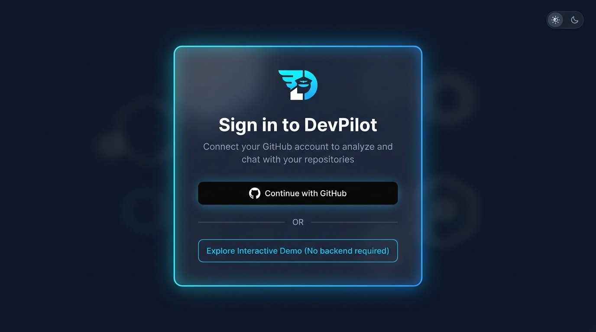

<br />

### 2. Repository Workspace Dashboard
*Real-time file ingestion progress, indexed commit tracking, and catalog overview.*

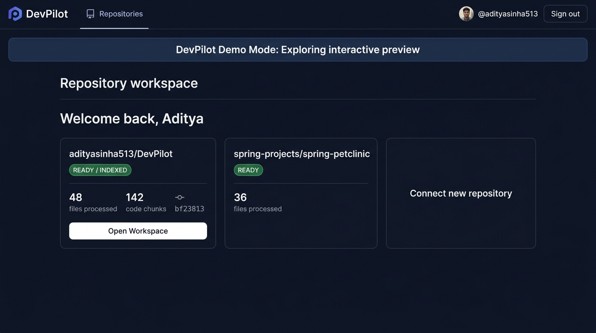

<br />

### 3. Repository Workspace & Conversations
*Threaded multi-conversation management scoped to specific repository commits.*

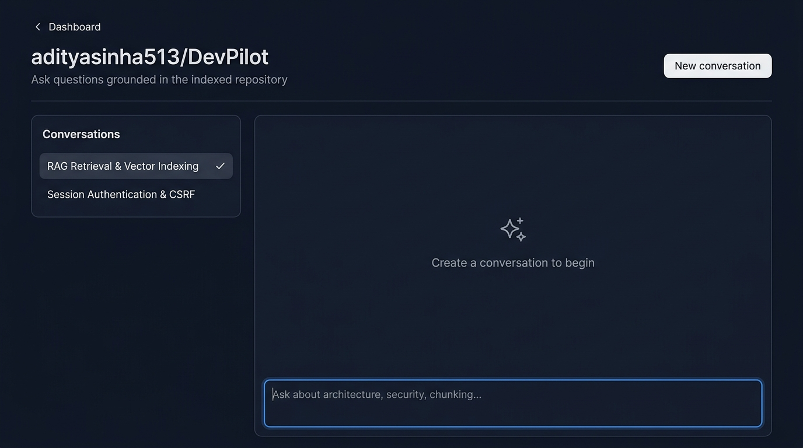

<br />

### 4. Interactive Natural Language Code Exploration
*Semantic Q&A grounded exclusively in authoritative repository source code.*

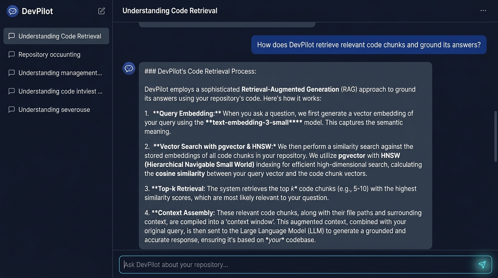

<br />

### 5. Verifiable Source-Level Citations
*Exact, clickable GitHub line ranges (`path#Lstart-Lend`) backing every AI assertion.*

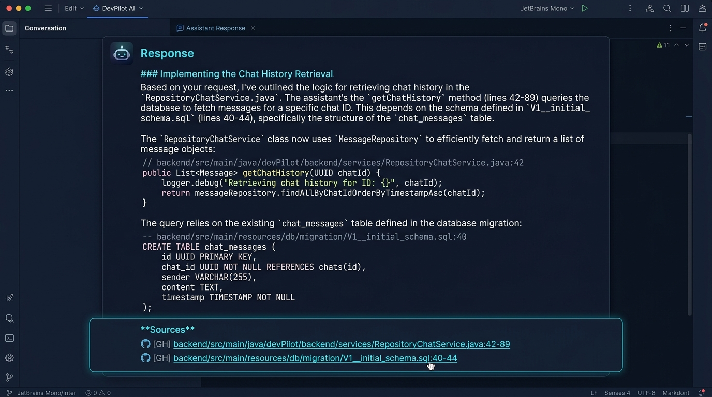

</div>

---

## 🏛️ System Architecture

DevPilot follows a clean decoupled client-server architecture designed for reliability, strict data isolation, and defense-in-depth security.

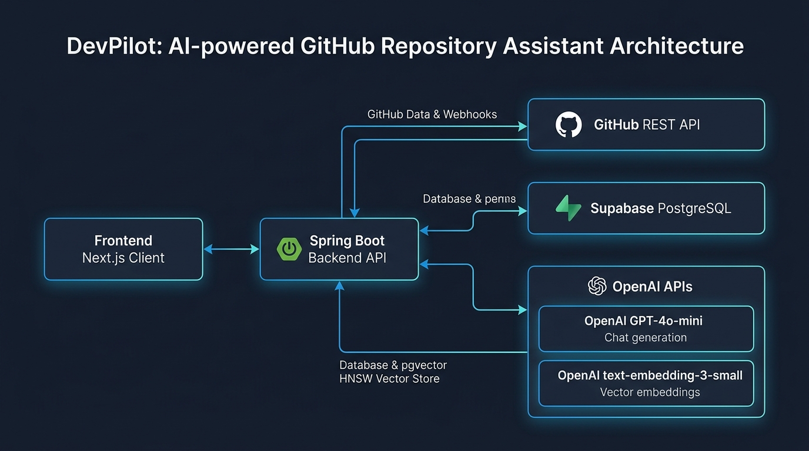

### Core Architectural Layers:
1. **Frontend Presentation**: Built on **Next.js 16 (App Router)** and **React 19**, featuring a responsive dark-mode design system with Tailwind CSS and TanStack React Query.
2. **Backend Engine**: A enterprise-grade **Spring Boot 4 / Java 21** application orchestrating OAuth2 security, file parsing, task recovery, and vector search.
3. **Database & Vector Storage**: **PostgreSQL 16+** enhanced with **pgvector** using **Hierarchical Navigable Small World (HNSW)** indexing for sub-millisecond approximate nearest neighbor (ANN) cosine retrieval.
4. **Schema Migrations**: Schema ownership strictly maintained via **Flyway**, operating in `validate` mode in production.
5. **AI Services**: Powered by OpenAI's `text-embedding-3-small` (1536-dimensional embeddings) and `gpt-4o-mini` for fast, highly accurate, context-grounded reasoning.

---

## 🔄 RAG Pipeline

DevPilot does not rely on naive keyword matching. It implements an end-to-end semantic **Retrieval-Augmented Generation (RAG)** pipeline optimized specifically for source code.

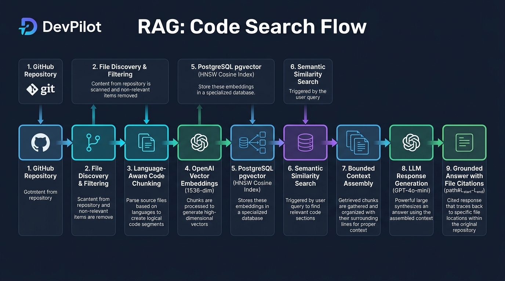

### The Retrieval-Augmented Generation Lifecycle:
```text
┌─────────────────────────┐
│   GitHub Repository     │ (Commit SHA scoped)
└───────────┬─────────────┘
            ▼
┌─────────────────────────┐
│ File Discovery & Filter │ (Discards binaries, lockfiles, build outputs)
└───────────┬─────────────┘
            ▼
┌─────────────────────────┐
│  Language-Aware Chunker │ (Sliding window overlap, preserves function boundaries)
└───────────┬─────────────┘
            ▼
┌─────────────────────────┐
│ OpenAI Vectorizer (API) │ (text-embedding-3-small, 1536 dimensions)
└───────────┬─────────────┘
            ▼
┌─────────────────────────┐
│  PostgreSQL + pgvector  │ (Indexed via HNSW vector_cosine_ops)
└───────────┬─────────────┘
            │
      [ User Query ]
            │
            ▼
┌─────────────────────────┐
│  HNSW Cosine Similarity │ (Retrieves top-K closest semantic code chunks)
└───────────┬─────────────┘
            ▼
┌─────────────────────────┐
│ Bounded Context Bundle  │ (Enforces token budget, attaches line metadata)
└───────────┬─────────────┘
            ▼
┌─────────────────────────┐
│    OpenAI GPT-4o-mini   │ (Strict system prompt: derive only from context)
└───────────┬─────────────┘
            ▼
┌─────────────────────────┐
│ Grounded Response + Ref │ (Verified GitHub file and line citations)
└─────────────────────────┘
```

---

## ⚙️ Repository Ingestion Flow

Ingestion is asynchronous, resilient to network interrupts, and tracked via explicit state machines.

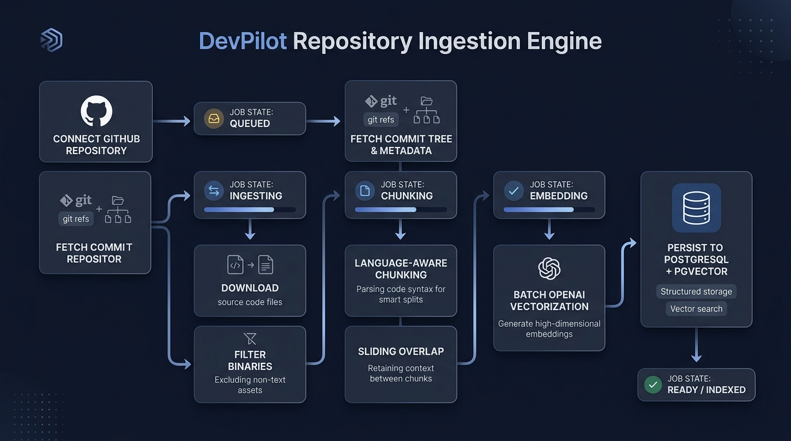

### Ingestion States:
- **`QUEUED`**: Repository registered; commit SHA identified from default branch.
- **`INGESTING`**: Recursive tree traversal via GitHub REST API; candidate source files downloaded and non-text artifacts excluded.
- **`CHUNKING`**: Files segmented using language heuristics, recording precise 1-indexed start and end line ranges.
- **`EMBEDDING`**: Chunks batched and submitted to OpenAI embedding endpoint with exponential backoff and rate-limit mitigation.
- **`READY`**: Vectors committed to PostgreSQL; pgvector HNSW index updated; workspace unlocked for interactive Q&A.
- **`FAILED_INGESTION`**: Handled via `IngestionRecoveryService`; interrupted jobs automatically surface recovery diagnostics without leaving repositories in locked states.

---

## 🔐 Authentication & Session Security

DevPilot enforces production-grade security standards to protect developer source code and GitHub credentials.

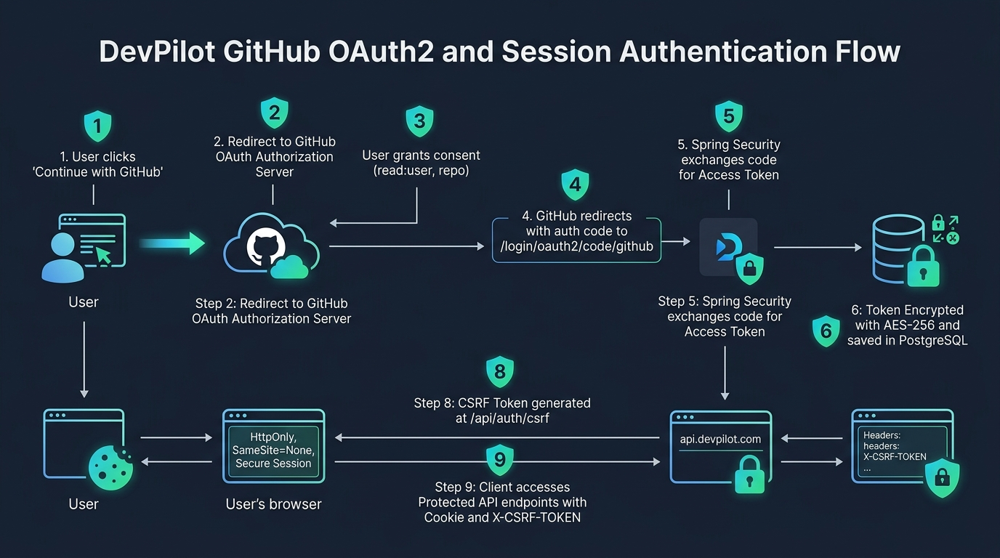

1. **GitHub OAuth2**: User authentication is delegated to GitHub with minimal scopes (`read:user`, `repo`).
2. **Symmetric AES-256 Token Encryption**: GitHub access tokens are encrypted with `TokenEncryptionService` prior to database insertion; raw tokens are never logged or stored in plaintext.
3. **Server-Side Session Cookies**: The browser never sees or handles access tokens. Sessions are authenticated via HttpOnly cookies (`DEVPILOT_SESSION`) with `SameSite=None; Secure` flags in production.
4. **CSRF Mitigation**: State-modifying requests (`POST`, `PUT`, `DELETE`) require a valid `X-CSRF-TOKEN` issued through `/api/auth/csrf`.
5. **Strict Authorization & Tenant Isolation**: Every repository and conversation access is validated against the authenticated user's ID.

---

## 🔁 End-to-End System Flow

The complete user journey from query submission to verified code citations:

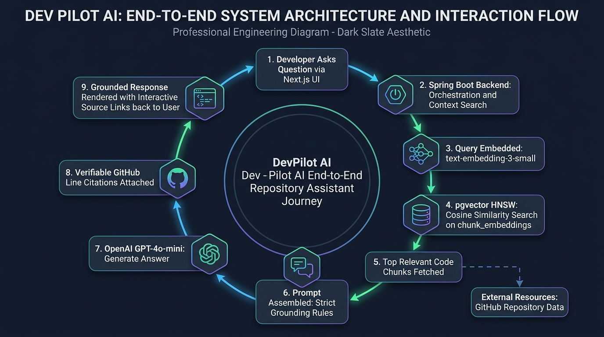

---

## 🛠️ Tech Stack & Technical Specifications

| Layer | Technology | Specification / Role |
|:---|:---|:---|
| **Backend Runtime** | Java 21 LTS | Eclipse Temurin 21 with modern language features |
| **Backend Framework** | Spring Boot 4.1.x | Enterprise application container, IoC, MVC |
| **Security** | Spring Security 6+ | OAuth2 Client, CSRF, encrypted sessions, strict CORS |
| **AI Integration** | Spring AI 2.0.1 | Abstraction layer for OpenAI chat and embeddings |
| **Database** | PostgreSQL 16+ | Relational data persistence + pgvector extension |
| **Vector Index** | pgvector HNSW | `vector_cosine_ops` approximate nearest neighbors |
| **Database Migrations** | Flyway 10+ | Schema version control (`V1__initial_schema.sql`) |
| **Connection Pooling** | HikariCP | High-performance JDBC connection management |
| **Frontend Framework** | Next.js 16 (App Router) | React Server Components, Turbopack, Fast Refresh |
| **Frontend UI** | React 19 + TypeScript 5 | Strict typing, declarative UI state |
| **State Management** | TanStack React Query v5 | Server state caching, optimistic updates, polling |
| **Styling** | Tailwind CSS 4 | Zero-runtime CSS, dark/light theme switching |
| **Containerization** | Docker | Multi-stage builder & minimal distroless/alpine runners |
| **CI / CD** | GitHub Actions | Automated build, test, and static deployment pipelines |

---

## 🗄️ Database Architecture & Flyway Schema

DevPilot maintains relational integrity through Flyway version control. In production environments, Hibernate operates strictly in validation mode (`spring.jpa.hibernate.ddl-auto=validate`).

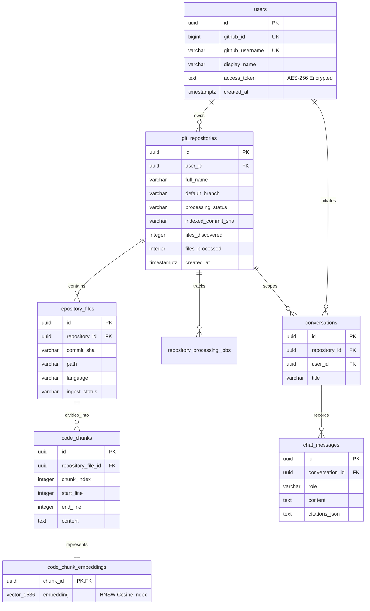

---

## 📡 REST API Reference

All protected endpoints require an active `DEVPILOT_SESSION` cookie and an `X-CSRF-TOKEN` on mutation requests.

### Authentication & Health
| Method | Endpoint | Description | Auth Required |
|:---|:---|:---|:---|
| `GET` | `/actuator/health` | Service health status and readiness/liveness probes | No |
| `GET` | `/api/auth/csrf` | Fetches fresh CSRF token (`X-CSRF-TOKEN`) | No |
| `GET` | `/api/auth/me` | Returns current authenticated user profile | Yes |
| `POST` | `/api/auth/logout` | Terminates session and invalidates cookie | Yes |

### Repository Management
| Method | Endpoint | Description | Auth Required |
|:---|:---|:---|:---|
| `GET` | `/api/repositories` | Lists all indexed repositories belonging to user | Yes |
| `GET` | `/api/repositories/catalog` | Browses user's available GitHub repositories | Yes |
| `POST` | `/api/repositories` | Connects a GitHub repository and starts ingestion | Yes |
| `GET` | `/api/repositories/{id}` | Fetches real-time status and file metrics | Yes |
| `POST` | `/api/repositories/{id}/retry-ingestion` | Re-triggers failed ingestion runs | Yes |

### Conversations & RAG Chat
| Method | Endpoint | Description | Auth Required |
|:---|:---|:---|:---|
| `GET` | `/api/repositories/{id}/conversations` | Lists conversation history for repository | Yes |
| `POST` | `/api/repositories/{id}/conversations` | Initiates a new conversation thread | Yes |
| `GET` | `/api/conversations/{id}/messages` | Fetches historical messages and citation data | Yes |
| `POST` | `/api/conversations/{id}/messages` | Submits question; returns grounded response & citations | Yes |

---

## 💻 Local Development

### Prerequisites
- **Java 21 LTS** (`java -version`)
- **Node.js 20+** (`node -v`)
- **Docker** (optional, for local PostgreSQL + pgvector)

### 1. Database Setup (Docker)
Start a local PostgreSQL container with pgvector:
```bash
docker run -d \
  --name devpilot-postgres \
  -e POSTGRES_DB=devpilot \
  -e POSTGRES_USER=postgres \
  -e POSTGRES_PASSWORD=postgres \
  -p 5433:5432 \
  pgvector/pgvector:pg16
```

### 2. Run the Backend
```bash
cd backend

# On Linux / macOS:
./mvnw spring-boot:run

# On Windows PowerShell:
.\mvnw.cmd spring-boot:run
```
*The Spring Boot server starts on `http://localhost:8080`. Flyway will automatically run `V1__initial_schema.sql` on startup.*

### 3. Run the Frontend
```bash
cd client
npm install
npm run dev
```
*The Next.js client starts on `http://localhost:3000`.*

---

## ⚙️ Environment Variables

### Backend Configuration (`backend/`)
| Variable | Description | Default / Example |
|:---|:---|:---|
| `DATABASE_URL` | PostgreSQL JDBC connection URL | `jdbc:postgresql://localhost:5433/devpilot` |
| `DATABASE_USERNAME` | Database username | `postgres` |
| `DATABASE_PASSWORD` | Database password | `postgres` |
| `GITHUB_CLIENT_ID` | GitHub OAuth2 Application Client ID | `Ov23li...` |
| `GITHUB_CLIENT_SECRET`| GitHub OAuth2 Application Client Secret | `sec_...` |
| `OPENAI_API_KEY` | OpenAI API Key for embeddings and chat | `sk-...` |
| `OPENAI_CHAT_MODEL` | LLM model for answer synthesis | `gpt-4o-mini` |
| `OPENAI_EMBEDDING_MODEL`| Embedding model name (1536 dim) | `text-embedding-3-small` |
| `TOKEN_ENCRYPTION_PASSWORD` | Symmetric encryption key for stored tokens | `StrongRandomPassphrase!` |
| `TOKEN_ENCRYPTION_SALT` | 16-character hex salt string | `0123456789abcdef` |
| `APP_FRONTEND_URL` | Deployed frontend domain for OAuth redirects | `http://localhost:3000` |
| `APP_CORS_ALLOWED_ORIGINS`| Allowed cross-origin sources | `http://localhost:3000` |
| `SPRING_PROFILES_ACTIVE` | Active Spring profile | `default` (or `prod`) |

### Frontend Configuration (`client/`)
| Variable | Description | Default / Example |
|:---|:---|:---|
| `NEXT_PUBLIC_API_BASE_URL` | Base URL of the Spring Boot API | `http://localhost:8080` |
| `NEXT_PUBLIC_DEMO_MODE` | Enable standalone UI preview mode | `false` (or `true` on Pages) |
| `NEXT_PUBLIC_BASE_PATH` | Base subpath for static hosting | `""` (or `"/DevPilot"`) |

> [!WARNING]
> Never commit `.env` files, API keys, OAuth secrets, database passwords, or encryption passphrases to Git. All secrets must be supplied via environment variables or secret managers.

---

## 🧪 Testing & Quality Assurance

DevPilot maintains a rigorous self-contained test suite that validates configuration, controllers, indexing heuristics, and recovery routines without external network or database dependencies:

```bash
cd backend
.\mvnw.cmd test
```

### Test Validation Summary:
- **`BackendApplicationTests`**: Verifies full Spring application context initialization.
- **`DatabaseConfigTest`**: Validates connection normalization for standard JDBC, Render URIs, and Supabase Session Pooler configurations with automatic SSL enforcement.
- **`CsrfControllerTest`**: Asserts token emission and null-safety headers.
- **`CodeChunkingServiceTest`**: Validates language-aware heuristic splits, sliding window offsets, and line boundary preservation.
- **`IngestionRecoveryServiceTest`**: Asserts automatic recovery of interrupted jobs from `QUEUED` / `INGESTING` to `FAILED_INGESTION` with completion timestamps.
- **`RepositoryChatServiceTest`**: Tests RAG prompt construction and bounded context injection.

```text
[INFO] Results:
[INFO] Tests run: 12, Failures: 0, Errors: 0, Skipped: 0
[INFO] BUILD SUCCESS
```

---

## 🧠 Engineering Decisions & Rationale

### Why PostgreSQL + pgvector?
Rather than introducing standalone vector databases (e.g. Pinecone, Milvus, Qdrant) that create data silos and eventual-consistency headaches, DevPilot stores code chunks, relational metadata, and vector embeddings in a single atomic ACID-compliant PostgreSQL database.

### Why HNSW Indexing?
Hierarchical Navigable Small World (HNSW) graph indexing provides superior recall-to-latency ratios compared to IVFFlat, eliminating the need to re-train index lists when repositories ingest thousands of new code chunks.

### Why Commit-Scoped Ingestion?
Code is dynamic. A function's line numbers shift on every commit. By indexing files strictly against specific commit SHAs (`git_repositories.indexed_commit_sha`), DevPilot ensures citations remain permanently verifiable against GitHub's commit tree without drift.

### Why Spring Boot for the AI Engine?
Spring Boot provides mature connection pooling (HikariCP), battle-tested transaction management (`@Transactional`), robust OAuth2 integration, and clean asynchronous job execution without requiring complex auxiliary runtime daemons.

### Why Flyway Over Hibernate Auto-DDL?
Using `ddl-auto=update` in production creates unpredictability. Flyway guarantees deterministic, repeatable, and version-controlled database evolutions where the `V1__initial_schema.sql` owns all pgvector extensions and index structures.

---

## 🔮 Roadmap

### Phase 1: V1.0.0 (Current Release)
- [x] GitHub OAuth2 integration with token encryption
- [x] Commit-scoped recursive file ingestion
- [x] Language-aware sliding-window chunking
- [x] OpenAI `text-embedding-3-small` vectorization
- [x] PostgreSQL + pgvector HNSW cosine search
- [x] Context-grounded Q&A with verifiable file citations
- [x] Automated ingestion crash recovery
- [x] Self-contained unit & integration test suite
- [x] Multi-stage Docker containerization
- [x] Static interactive demo deployment via GitHub Actions

### Phase 2: V1.1 (Near-Term)
- [ ] Tree-sitter AST (Abstract Syntax Tree) parsing for method-level boundary extraction
- [ ] Multi-repository comparative search across organizations
- [ ] Granular citation previews with inline syntax highlighting
- [ ] Repository commit diff and PR review assistant mode

### Phase 3: V2.0 (Enterprise Architecture)
- [ ] Distributed ingestion workers decoupled via Apache Kafka or RabbitMQ
- [ ] Multi-provider LLM routing (Anthropic Claude 3.5 Sonnet, Google Gemini 2.0 Flash)
- [ ] Codebase dependency graph exploration with Neo4j / pgvector hybrid graph search
- [ ] Self-hosted local LLM embedding support via Ollama / TEI

---

## 🤝 Contributing

Contributions are welcome! Please feel free to submit issues or pull requests.
1. Fork the repository.
2. Create your feature branch (`git checkout -b feature/amazing-feature`).
3. Commit your changes (`git commit -m 'feat: add amazing feature'`).
4. Push to the branch (`git push origin feature/amazing-feature`).
5. Open a Pull Request.

---

<div align="center">

**DevPilot** — Bridging developer intent and source code reality.

Crafted with precision by [Aditya Sinha](https://github.com/adityasinha513).

</div>
