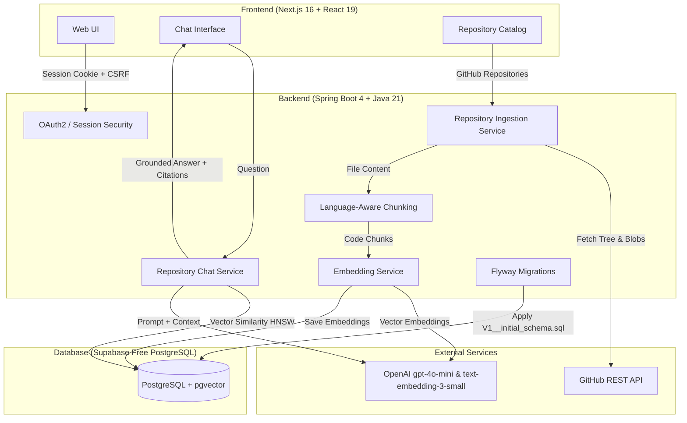

# DevPilot

DevPilot is an AI-powered GitHub repository assistant that lets developers connect a repository, index its codebase, and ask grounded questions about the code using semantic retrieval and Retrieval-Augmented Generation (RAG).

---

## Architecture



---

## Tech Stack

### Backend
- **Java 21** with **Spring Boot 4.1.x**
- **Spring Security** with OAuth2 Client & session cookie protection (`SameSite=None`, `Secure` in production)
- **Spring AI 2.0.1** (OpenAI Chat `gpt-4o-mini`, Embeddings `text-embedding-3-small`)
- **Spring Data JPA** with Hibernate (DDL validation mode in production)
- **Flyway** for database migrations (`flyway-database-postgresql`)
- **Spring Boot Actuator** (`/actuator/health`, liveness/readiness probes)
- **HikariCP** connection pool with URL normalization for cloud databases
- **Maven** build system

### Frontend
- **Next.js 16** (App Router, Turbopack)
- **React 19** & **TypeScript**
- **TanStack React Query v5**
- **Tailwind CSS 4** with responsive themes (dark/light)
- Self-contained UI styling (no compile-time external font downloads)

### Database & Storage
- **PostgreSQL 16+** with the **pgvector** extension
- HNSW index with cosine similarity metric (`vector_cosine_ops`)

---

## Core Features

- **GitHub OAuth2 Authentication**: Secure sign-in with GitHub. User access tokens are encrypted with AES-256 before database storage and never exposed to the client.
- **CSRF & Session Security**: Cookie-based authentication with CSRF tokens on state-changing requests, cross-site cookie support (`SameSite=None; Secure`), and Spring Security Authorization.
- **Repository Ingestion & Progress Tracking**: Resolves default branch commit SHA, discovers candidate files, filters out binaries and vendor artifacts, and tracks real-time file counts.
- **Ingestion Recovery**: In the event of service restart during indexing, `IngestionRecoveryService` automatically transitions interrupted jobs from `RUNNING`/`QUEUED` to `FAILED_INGESTION` with helpful error messages, allowing clean user retries without duplicate processing.
- **Language-Aware Chunking**: Heuristic chunking splitting files by logical boundaries with sliding window overlaps and line-number tracking.
- **Semantic Code Retrieval**: Queries are embedded and compared against stored chunk vectors using pgvector HNSW cosine distance.
- **Grounded Q&A with Citations**: Responses are constrained to authoritative source code context. Every answer includes verifiable GitHub file and line-range citations (`path#Lstart-Lend`).
- **Resilient External Integrations**: Outbound GitHub and OpenAI API calls include bounded retries, exponential backoff, connection/read timeouts, and fast-fail behavior on permanent client errors (HTTP 4xx).

---

## RAG Pipeline

```text
GitHub Repository
  │
  ▼
Fetch Commit Tree & Filter Candidate Files
  │
  ▼
Extract Text & Heuristic Chunking (Language-aware, line numbers)
  │
  ▼
Generate Vector Embeddings (text-embedding-3-small, 1536 dim)
  │
  ▼
Store in PostgreSQL + pgvector (HNSW cosine similarity index)
  │
  ▼
User Query -> Embed Query -> HNSW Cosine Similarity Search
  │
  ▼
Assemble Bounded Context Bundle & Conversation History
  │
  ▼
OpenAI Prompt (System Instructions: strictly grounded, citations attached)
  │
  ▼
Assistant Message + Verified GitHub Line-Range Citations
```

---

## Local Development

### Prerequisites
- **Java 21** JDK installed
- **Node.js 20+** and **npm**
- **Docker Desktop** (for local PostgreSQL with pgvector)
- An **OpenAI API Key**
- A **GitHub OAuth Application**

### 1. Clone the Repository
```bash
git clone https://github.com/adityasinha513/DevPilot.git
cd DevPilot
```

### 2. Start Local PostgreSQL with pgvector
```bash
docker compose up -d postgres
```
This starts PostgreSQL on port `5433` with the `devpilot` database and pgvector extension pre-installed.

### 3. Configure Backend Environment
Copy the example environment file:
```bash
cp backend/.env.example backend/.env
```
Populate `backend/.env` with your values:
```properties
DATABASE_URL=jdbc:postgresql://localhost:5433/devpilot
DATABASE_USERNAME=postgres
DATABASE_PASSWORD=postgres
GITHUB_CLIENT_ID=your_github_client_id
GITHUB_CLIENT_SECRET=your_github_client_secret
OPENAI_API_KEY=your_openai_api_key
TOKEN_ENCRYPTION_PASSWORD=local-dev-secret-password-12345
TOKEN_ENCRYPTION_SALT=0123456789abcdef
APP_FRONTEND_URL=http://localhost:3000
APP_CORS_ALLOWED_ORIGINS=http://localhost:3000
```

### 4. Run the Backend
On Windows (PowerShell):
```powershell
cd backend
.\mvnw.cmd spring-boot:run
```
On Linux/macOS:
```bash
cd backend
./mvnw spring-boot:run
```
The backend starts on `http://localhost:8080`. Flyway automatically executes database migrations upon startup.

To run the test suite:
```powershell
.\mvnw.cmd test
```

### 5. Run the Frontend
In another terminal:
```bash
cd client
npm install
npm run dev
```
The frontend runs at `http://localhost:3000`.

---

## Database Setup & Flyway Migrations

DevPilot manages its database schema exclusively through **Flyway**.
In production, Hibernate DDL auto-generation is disabled (`spring.jpa.hibernate.ddl-auto=validate`) to ensure Flyway owns schema state and transitions.

The initial migration `V1__initial_schema.sql` creates:
- `vector` extension
- `users`: GitHub profile data, encrypted access tokens, timestamps
- `git_repositories`: Tracked repositories, ingestion counters, indexed commit SHA
- `repository_processing_jobs`: Ingestion run history, statuses, timestamps
- `repository_files`: Indexed file metadata, language, sizes, blob hashes
- `code_chunks`: Deterministic file chunks with start/end line bounds
- `code_chunk_embeddings`: 1536-dimensional vector column with an **HNSW index** using `vector_cosine_ops`
- `conversations` & `chat_messages`: Multi-turn chat history with citation metadata

---

## Docker Usage

Both services include multi-stage Dockerfiles optimized for production deployment:

### Build Backend Image
```bash
docker build -t devpilot-backend ./backend
```
Runs a multi-stage build using `maven:3.9-eclipse-temurin-21` and packages a minimal JRE 21 runtime container running under a dedicated non-root `devpilot` user on port `8080`.

### Build Frontend Image
```bash
docker build -t devpilot-client ./client
```
Runs a multi-stage Alpine build with Next.js Turbopack compilation and creates a minimal Node.js production runner on port `3000`.

---

## Free Production Deployment (Render + Supabase)

DevPilot is architected for **100% free hosting with zero credit-card requirements**:
- **Frontend**: Render Free Web Service (`devpilot-client`)
- **Backend**: Render Free Web Service (`devpilot-backend`)
- **Database & Vectors**: Supabase Free PostgreSQL 16+ with `pgvector`

---

### Step 1: Set Up Supabase Free Database

1. Sign up or log into [Supabase](https://supabase.com).
2. Click **New Project**:
   - **Name**: `devpilot`
   - **Database Password**: Choose and safely record a strong password.
   - **Pricing Plan**: Free tier ($0/mo).
3. **Verify/Enable pgvector**:
   - In your Supabase dashboard, navigate to **Database** → **Extensions**.
   - Search for `vector`. If not already enabled, toggle it on (Flyway's `V1__initial_schema.sql` also executes `CREATE EXTENSION IF NOT EXISTS vector;` on first migration).
4. **Obtain Connection Details**:
   - Click **Connect** (or project **Settings** → **Database**).
   - In the connection mode selector, choose **Session pooler** (port `5432`).
   - Copy your connection string or individual components:
     - **Host**: `aws-0-[region].pooler.supabase.com`
     - **Port**: `5432`
     - **Database**: `postgres`
     - **User**: `postgres.[your-project-ref]`
     - **Password**: `[your-database-password]`

---

### Step 2: Register GitHub OAuth Application

1. In GitHub, go to **Settings** → **Developer settings** → **OAuth Apps** → **New OAuth App**.
2. Fill in:
   - **Application Name**: `DevPilot Production`
   - **Homepage URL**: `https://devpilot-client.onrender.com` *(or your custom client URL)*
   - **Authorization callback URL**:
     ```text
     https://devpilot-backend.onrender.com/login/oauth2/code/github
     ```
3. Click **Register application**.
4. Generate and copy your **Client ID** and **Client Secret**.

---

### Step 3: Deploy on Render Free Tier

You can deploy using Render's Blueprint with [`render.yaml`](render.yaml) or by manually creating two free Web Services:

#### Option A: Via Render Blueprint
1. Log into [Render Dashboard](https://dashboard.render.com).
2. Click **New +** → **Blueprint**.
3. Select your repository: `adityasinha513/DevPilot`.
4. Render will parse `render.yaml` and configure two free Web Services (`devpilot-backend` and `devpilot-client`).
5. Fill in the prompted environment variables (listed below) and click **Apply**.

#### Option B: Manual Web Service Creation (Alternative)
1. **Backend Service**:
   - Click **New +** → **Web Service** → Select repository.
   - **Name**: `devpilot-backend`
   - **Root Directory**: `backend`
   - **Runtime**: `Docker` (using `./Dockerfile`)
   - **Instance Type**: **Free**
   - **Health Check Path**: `/actuator/health`
   - Add backend environment variables below.
2. **Frontend Service**:
   - Click **New +** → **Web Service** → Select repository.
   - **Name**: `devpilot-client`
   - **Root Directory**: `client`
   - **Runtime**: `Docker` (using `./Dockerfile`)
   - **Instance Type**: **Free**
   - Set Build Argument: `NEXT_PUBLIC_API_BASE_URL=https://devpilot-backend.onrender.com`
   - Set Environment Variable: `NEXT_PUBLIC_API_BASE_URL=https://devpilot-backend.onrender.com`

---

## Environment Variables Reference

### Backend (`devpilot-backend`)
| Variable | Value / Description |
|---|---|
| `DATABASE_URL` | Supabase Session Pooler URL (e.g. `jdbc:postgresql://aws-0-[region].pooler.supabase.com:5432/postgres?sslmode=require` or `postgresql://...`) |
| `DATABASE_USERNAME` | Supabase pooler username (e.g. `postgres.[project-ref]`) |
| `DATABASE_PASSWORD` | Your Supabase database password |
| `SPRING_PROFILES_ACTIVE` | `prod` |
| `PORT` | `8080` |
| `GITHUB_CLIENT_ID` | Your GitHub OAuth App Client ID |
| `GITHUB_CLIENT_SECRET` | Your GitHub OAuth App Client Secret |
| `OPENAI_API_KEY` | Your OpenAI API Key (`sk-...`) |
| `TOKEN_ENCRYPTION_PASSWORD` | Strong random encryption passphrase for token encryption |
| `TOKEN_ENCRYPTION_SALT` | `0123456789abcdef` |
| `APP_FRONTEND_URL` | `https://devpilot-client.onrender.com` |
| `APP_CORS_ALLOWED_ORIGINS` | `https://devpilot-client.onrender.com` |

### Frontend (`devpilot-client`)
| Variable | Value / Description |
|---|---|
| `NEXT_PUBLIC_API_BASE_URL` | `https://devpilot-backend.onrender.com` *(Set in both Docker Build Arguments and Environment Variables)* |

---

## Known V1 Limitations

- **File Chunking**: Employs heuristic sliding-window chunking by line count rather than AST-based parsing.
- **In-Process Ingestion**: Ingestion tasks execute asynchronously on a dedicated thread pool rather than a distributed broker (such as Kafka or RabbitMQ).
- **Single-Host Concurrency**: Suitable for single-instance or active-passive instances. Multi-instance horizontal scaling for ingestion would require a distributed task coordinator.
- **Repository Size Limit**: Default maximum file size threshold is 100 KB to avoid embedding large generated assets or bundle outputs.

---

## License

MIT License. See [LICENSE](LICENSE) for details.
