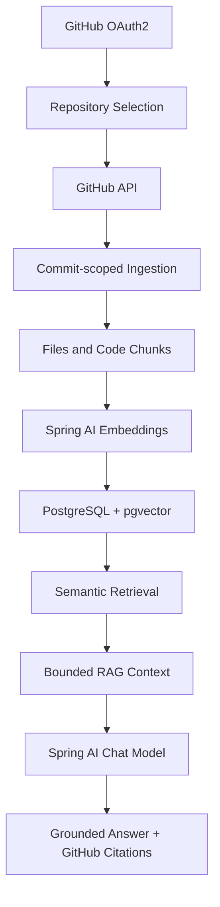

# DevPilot

DevPilot is an AI-powered GitHub repository assistant that lets developers connect a repository, index its codebase, and ask grounded questions about the code using semantic retrieval and Retrieval-Augmented Generation (RAG).

## Features

- GitHub OAuth2 authentication
- GitHub repository catalog and repository connection
- Commit-scoped repository ingestion
- Language-aware heuristic code chunking
- Spring AI chat and embedding models
- PostgreSQL with pgvector storage
- Semantic code retrieval with bounded context selection
- Grounded repository Q&A
- Conversation history
- File and line-level GitHub citations
- Repository and conversation ownership checks
- Ingestion progress tracking
- Retry handling for failed ingestion
- Dark/light theme support in the web client

## Architecture



## Tech Stack

### Backend

- Java 21
- Spring Boot 4.x
- Spring Security OAuth2 Client
- Spring AI
- Spring Data JPA
- PostgreSQL
- pgvector
- Maven

### Frontend

- Next.js 16
- React 19
- TypeScript
- TanStack React Query
- Tailwind CSS 4
- shadcn-style UI components

### Infrastructure

- Docker Compose
- PostgreSQL with the pgvector extension

## How It Works

1. A user signs in with GitHub OAuth2.
2. DevPilot loads repositories available to the authenticated GitHub user.
3. The user connects a repository by URL or repository reference.
4. The backend resolves the current default-branch commit and downloads eligible files.
5. Files are filtered, language-detected, and split into bounded code chunks.
6. Spring AI generates embeddings that are stored in PostgreSQL through pgvector.
7. Chat questions retrieve similar chunks and build a bounded repository context.
8. The chat model answers from that context and the API returns GitHub file and line citations.

## Local Setup

### Prerequisites

- Java 21
- Node.js and npm
- Docker Desktop
- An OpenAI API key
- A GitHub OAuth application

### 1. Clone the repository

```powershell
git clone <repository-url>
cd DevPilot
```

### 2. Configure environment variables

Copy the backend example and provide local values:

```powershell
Copy-Item backend/.env.example backend/.env
```

The Spring Boot process must receive these variables in its environment. Do not commit the copied file. The frontend can use `client/.env.example` for the API base URL.

### 3. Start PostgreSQL and pgvector

```powershell
docker compose up -d postgres
```

The compose file exposes PostgreSQL on `localhost:5433` and creates the `devpilot` database.

### 4. Start the backend

```powershell
Set-Location backend
.\mvnw.cmd spring-boot:run
```

The backend listens on `http://localhost:8080`.

### 5. Start the frontend

In a second terminal:

```powershell
Set-Location client
npm install
npm run dev
```

The frontend runs at `http://localhost:3000`.

## Environment Variables

Backend variables are listed in [backend/.env.example](backend/.env.example). The frontend variable is listed in [client/.env.example](client/.env.example).

| Variable | Description |
|---|---|
| `OPENAI_API_KEY` | OpenAI credential used by Spring AI for chat and embeddings |
| `OPENAI_CHAT_MODEL` | Chat model name, defaulting to `gpt-4o-mini` |
| `OPENAI_EMBEDDING_MODEL` | Embedding model name, defaulting to `text-embedding-3-small` |
| `GITHUB_CLIENT_ID` | GitHub OAuth application client ID |
| `GITHUB_CLIENT_SECRET` | GitHub OAuth application secret |
| `DATABASE_URL` | JDBC URL for PostgreSQL |
| `DATABASE_USERNAME` | PostgreSQL username |
| `DATABASE_PASSWORD` | PostgreSQL password |
| `TOKEN_ENCRYPTION_PASSWORD` | Password used to encrypt stored GitHub access tokens |
| `TOKEN_ENCRYPTION_SALT` | Salt used by the token encryptor |
| `NEXT_PUBLIC_API_BASE_URL` | Browser-visible backend URL used by the Next.js client |

Never commit `.env` files, API keys, OAuth secrets, database passwords, encryption values, or other credentials.

## GitHub OAuth Setup

Create a GitHub OAuth application and configure its callback URL as:

```text
http://localhost:8080/login/oauth2/code/github
```

Set the generated client ID and secret through `GITHUB_CLIENT_ID` and `GITHUB_CLIENT_SECRET`. The application requests `read:user` and `repo` scopes so it can list and read repositories available to the signed-in user.

## Project Structure

```text
backend/
  src/main/java/devPilot/backend/
    config/       Application, security, CORS, crypto, and vector setup
    controllers/  Authentication, repository, and chat APIs
    entity/       JPA domain entities
    github/       GitHub API models and services
    indexing/     File filtering, language detection, and chunking
    services/     Ingestion, embeddings, retrieval, and chat workflows
  src/test/       Backend unit and integration tests
client/
  app/            Next.js routes and pages
  components/     Layout, repository, auth, and UI components
  lib/            API and authentication clients
docker/
  postgres/       PostgreSQL extension initialization
docker-compose.yml
```

## RAG Pipeline

```text
Repository
  -> files
  -> code chunks
  -> embeddings
  -> pgvector
  -> similarity retrieval
  -> bounded context
  -> chat model
  -> grounded answer and citations
```

Answers are generated from retrieved repository context. The application attaches citations for the source file and line range used by the response.

## Security

- GitHub OAuth2 handles authentication.
- GitHub access tokens are encrypted before persistence with the configured token encryptor.
- Protected API operations require an authenticated session.
- Repository reads and writes verify the owning user on the server.
- Conversation and message operations verify repository/user ownership.
- Secrets are supplied through environment variables rather than committed configuration.
- The session cookie is HTTP-only and uses `SameSite=Lax` for local development.

## Limitations / Future Improvements

- Code chunking is language-aware and heuristic rather than AST-based.
- Embedding calls are currently processed sequentially during ingestion.
- Ingestion jobs run asynchronously in-process and do not use a durable queue.
- Production deployments would benefit from centralized observability, rate limiting, and a managed job worker.

## License

No license file is currently present in the repository.
